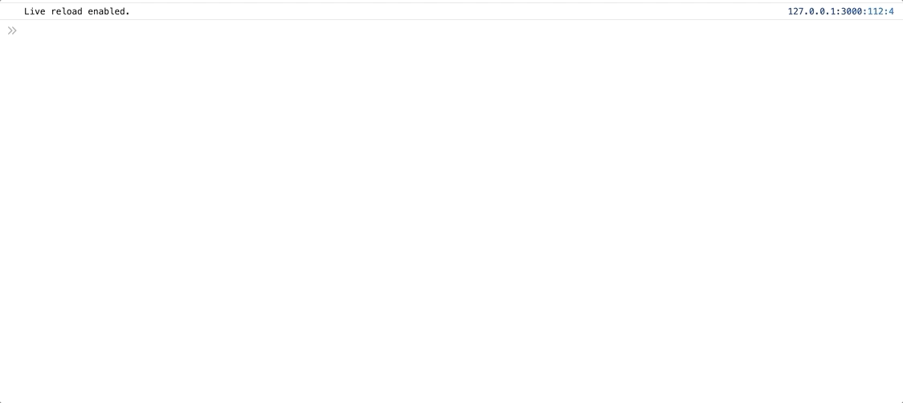

:bomb: Buscaminas :bomb:
----
Abre el juego [aquí](https://iesgrancapitan-dwec.github.io/Buscaminas-JesusMejiasLeiva)

------------

 ### :exclamation: ¿Cómo puedo ver el tablero para hacer las pruebas? :exclamation:

------------

Solo es necesario hacer un ```buscaminas.mostrar()``` en la consola, **una vez se haya elegido el nivel del juego**. Las casillas que muestren una ```x``` indican que en ella se encuentra una mina.



------------

 ### :dizzy: Efectos Jquery para las funcionalidades básicas :dizzy:

------------
#### Click (Abrir casilla)


:rocket: [Invocación](https://github.com/iesgrancapitan-dwec/Buscaminas-JesusMejiasLeiva/blob/master/js/gui.js#L96)

:memo: [Función](https://github.com/iesgrancapitan-dwec/Buscaminas-JesusMejiasLeiva/blob/master/js/gui.js#L282)

:zap: [Aquí se añade el efecto Jquery](https://github.com/iesgrancapitan-dwec/Buscaminas-JesusMejiasLeiva/blob/master/js/gui.js#L247)


------------
#### Click derecho (Colocar o quitar bandera)


:rocket: [Invocación](https://github.com/iesgrancapitan-dwec/Buscaminas-JesusMejiasLeiva/blob/master/js/gui.js#L108)

:memo: [Función](https://github.com/iesgrancapitan-dwec/Buscaminas-JesusMejiasLeiva/blob/master/js/gui.js#L316)

:zap: [Aquí se añade el efecto Jquery](https://github.com/iesgrancapitan-dwec/Buscaminas-JesusMejiasLeiva/blob/master/js/gui.js#L324)


------------

#### Click con ambos botones o pulsación larga (despejar)


:rocket: [Invocación.](https://github.com/iesgrancapitan-dwec/Buscaminas-JesusMejiasLeiva/blob/master/js/gui.js#L111) Pulsación dos botones

:rocket: [Invocación](https://github.com/iesgrancapitan-dwec/Buscaminas-JesusMejiasLeiva/blob/master/js/gui.js#L127). Pulsación larga

:memo: [Función](https://github.com/iesgrancapitan-dwec/Buscaminas-JesusMejiasLeiva/blob/master/js/gui.js#L187)

:zap: [Aquí se añade el efecto Jquery.](https://github.com/iesgrancapitan-dwec/Buscaminas-JesusMejiasLeiva/blob/master/js/gui.js#L197)


------------

#### Ganar


:rocket: Se invoca en la captura de la exception correspondiente.

:memo: [Función](https://github.com/iesgrancapitan-dwec/Buscaminas-JesusMejiasLeiva/blob/master/js/gui.js#L355)

:zap: [Muestro ventana emergente con Swal](https://github.com/iesgrancapitan-dwec/Buscaminas-JesusMejiasLeiva/blob/master/js/gui.js#L299)

------------
#### Perder


:rocket: Se invoca en la captura de la exception correspondiente.

:memo: [Función ](https://github.com/iesgrancapitan-dwec/Buscaminas-JesusMejiasLeiva/blob/master/js/gui.js#L355)

:zap: [Muestro ventana emergente con Swal](https://github.com/iesgrancapitan-dwec/Buscaminas-JesusMejiasLeiva/blob/master/js/gui.js#L304)
