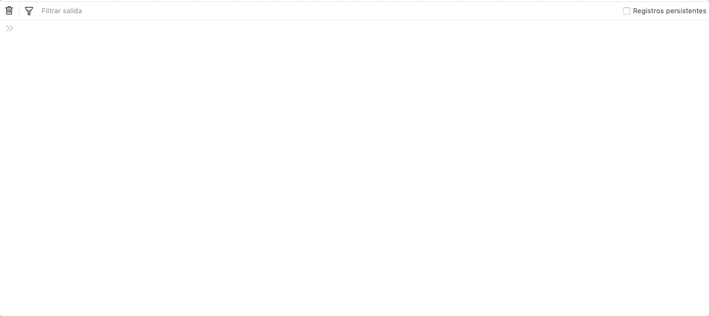
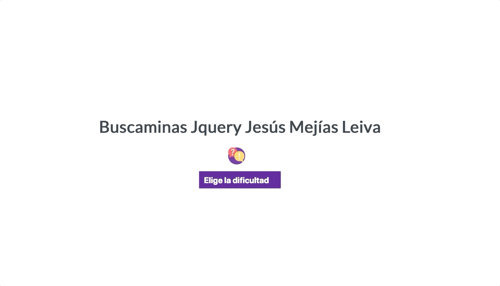
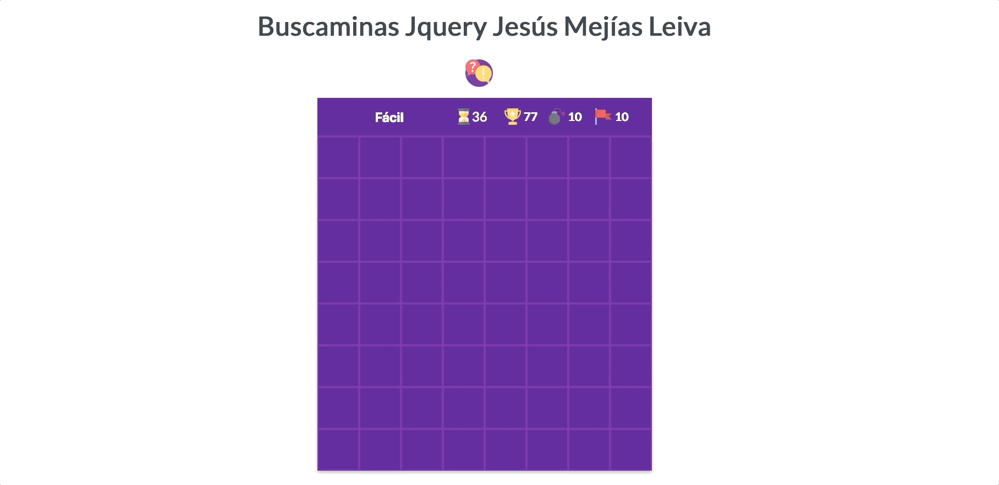
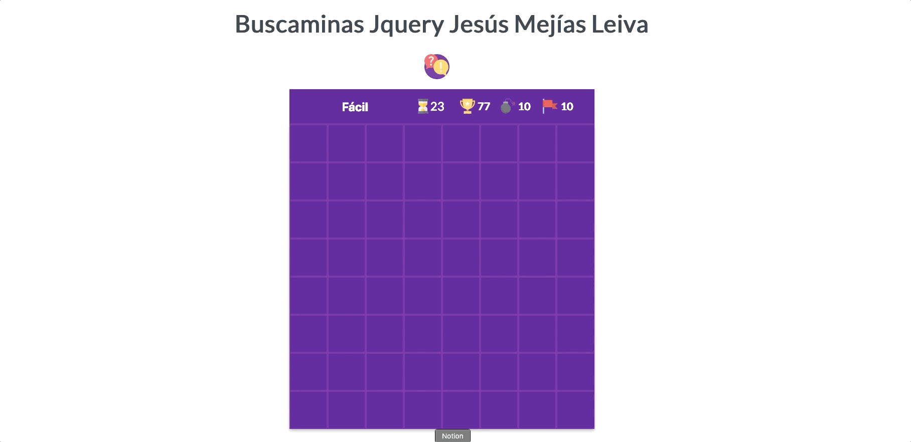
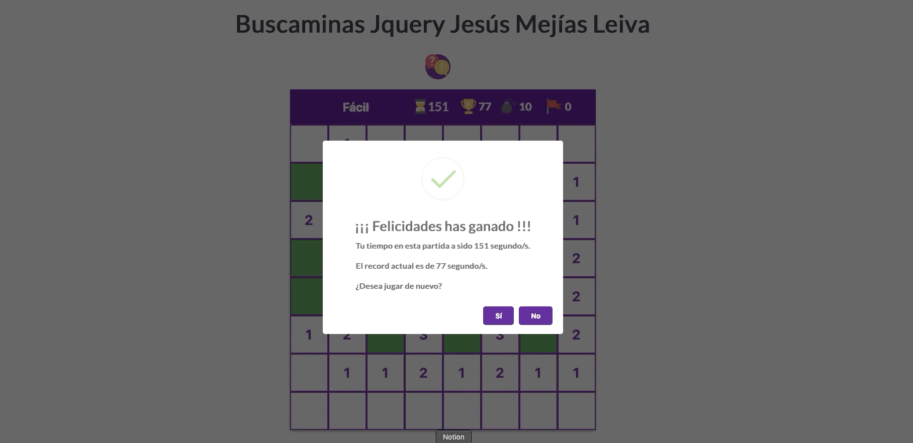
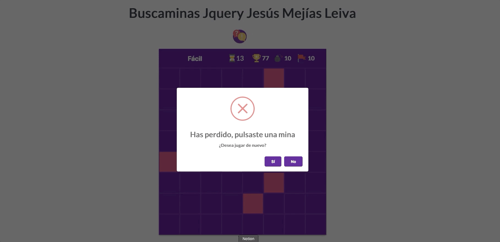

:bomb: Buscaminas :bomb:
----
Abre el juego [aquí](https://iesgrancapitan-dwec.github.io/Buscaminas-JesusMejiasLeiva)

------------

 ### :exclamation: ¿Cómo puedo ver el tablero para hacer las pruebas? :exclamation:

------------

Solo es necesario hacer un ```buscaMinas.mostrar()``` en la consola, **una vez se haya elegido el nivel del juego**. Las casillas que muestren una ```x``` indican que en ella se encuentra una mina.




------------

 ### :exclamation: ¿Muy pesado a la hora de hacer los testeos con tantas minas? :exclamation:

------------

Para solucionar esta **tediosa tarea**, se ha **añadido un nivel llamado testeo** el cual nos **dibuja una cuadrícula de 3x3 y 4 minas**, como se puede comprobar es mucho más eficiente a la hora de **testear**.



------------

 ### :dizzy: Efectos jquery para las funcionalidades básicas :dizzy:

------------
#### Click (Abrir casilla)



:rocket: [Invocación](https://github.com/iesgrancapitan-dwec/Buscaminas-JesusMejiasLeiva/blob/e2033139c8581f137b01397a4815004dfa976693/js/gui.js#L93)

:memo: [Función](https://github.com/iesgrancapitan-dwec/Buscaminas-JesusMejiasLeiva/blob/e2033139c8581f137b01397a4815004dfa976693/js/gui.js#L272)

:zap: [Aquí se añade el efecto jquery](https://github.com/iesgrancapitan-dwec/Buscaminas-JesusMejiasLeiva/blob/e2033139c8581f137b01397a4815004dfa976693/js/gui.js#L145)


------------
#### Click derecho (Colocar o quitar bandera)



:rocket: [Invocación](https://github.com/iesgrancapitan-dwec/Buscaminas-JesusMejiasLeiva/blob/e2033139c8581f137b01397a4815004dfa976693/js/gui.js#L105)

:memo: [Función](https://github.com/iesgrancapitan-dwec/Buscaminas-JesusMejiasLeiva/blob/e2033139c8581f137b01397a4815004dfa976693/js/gui.js#L308)

:zap: [Aquí se añade el efecto jquery](https://github.com/iesgrancapitan-dwec/Buscaminas-JesusMejiasLeiva/blob/e2033139c8581f137b01397a4815004dfa976693/js/gui.js#L316)


------------

#### Click con ambos botones o pulsación larga (despejar)


:rocket: [Invocación.](https://github.com/iesgrancapitan-dwec/Buscaminas-JesusMejiasLeiva/blob/e2033139c8581f137b01397a4815004dfa976693/js/gui.js#L108) Pulsación dos botones

:rocket: [Invocación](https://github.com/iesgrancapitan-dwec/Buscaminas-JesusMejiasLeiva/blob/e2033139c8581f137b01397a4815004dfa976693/js/gui.js#L124). Pulsación larga

:memo: [Función](https://github.com/iesgrancapitan-dwec/Buscaminas-JesusMejiasLeiva/blob/master/js/gui.js#L187)

:zap: [Aquí se añade el efecto jquery.](https://github.com/iesgrancapitan-dwec/Buscaminas-JesusMejiasLeiva/blob/e2033139c8581f137b01397a4815004dfa976693/js/gui.js#L195)


------------

#### Ganar



:rocket: Se invoca en la captura de la exception correspondiente.

:memo: [Función](https://github.com/iesgrancapitan-dwec/Buscaminas-JesusMejiasLeiva/blob/e2033139c8581f137b01397a4815004dfa976693/js/gui.js#L290)

:zap: [Muestro ventana emergente con Swal](https://github.com/iesgrancapitan-dwec/Buscaminas-JesusMejiasLeiva/blob/e2033139c8581f137b01397a4815004dfa976693/js/gui.js#L334)

------------
#### Perder



:rocket: Se invoca en la captura de la exception correspondiente.

:memo: [Función ](https://github.com/iesgrancapitan-dwec/Buscaminas-JesusMejiasLeiva/blob/e2033139c8581f137b01397a4815004dfa976693/js/gui.js#L290)

:zap: [Muestro ventana emergente con Swal](https://github.com/iesgrancapitan-dwec/Buscaminas-JesusMejiasLeiva/blob/e2033139c8581f137b01397a4815004dfa976693/js/gui.js#L334)
